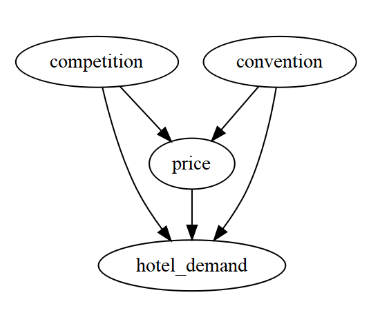
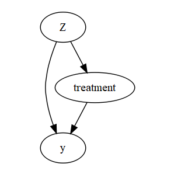
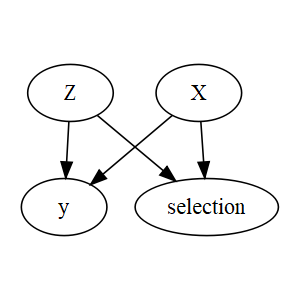
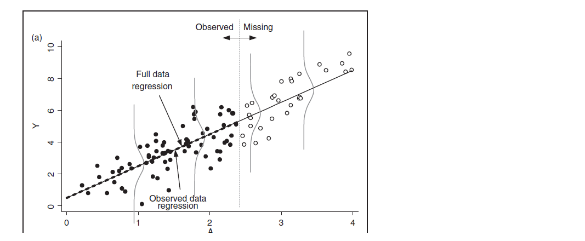

```{r setup, include=FALSE}
knitr::opts_chunk$set(echo = TRUE)
```


## Objectives

We provide an outline for a future project and research report on selection issues in modeling. 

We will focus on the following:

* Use reject inference in risk modeling and campaign selection in marketing campaigns as two case studies 

* Understand the (differences in) impacts in casual inference and predictions (and the decisions based on either the inference or the predictions)

* The connection and differences between sample-selection and endogeneity

* Linkage with counter-factual framework, casual network framework, econometric approaches (such as heckman two steps, instrument variables) and missing data framework 


## Reject Inference in Credit risk Modeling 

In application scorecard development, we need to start with data. Consider the following data generation Process

* Receive applications from general population (A)
* A subset of A would be approved by the current underwriting system (B)
* A-B are rejected
* For accounts in B, we observe for a period of time (say a year) and record delinquent status
* The new scorecard model is built using B (delinquent~ application attributes)
* This new model will be used as part of new underwriting system to screen all future applicants (a future version of A)

Ideally, we would accept all applications (or stratified random sampling) to collect data. Banks do that from time to time. In general,that would be too expensive and reject inference will be handled with modeling or other data augmentation. 

## Some Useful References in Risk Scorecards (not PD in CCAR)

*Advanced Credit Risk Analysis and Management by Ciby Joseph

*Credit Risk Analytics, Measurement Techniques, Applications and Examples in SAS bBaesens et. al. 

*Credit Scoring and Its Applications by Thomas et. al. 

*Credit Scoring Toolkit by Anderson

*Building and Implementing Better Credit Risk Scorecards by Naeem Siddiqi

## Campaign Response Modeling  

A very similar situation in marketing where the sample used for modeling was based on past model based selections. 

See
How Current Targeting can hinder Targeting in the future and what to do about it by Rhee & McIntyre (Database Marketing & Customer Strategy Management 2009)

## Solutions  

* Selection occurred, but is independent of the issues or outcomes of our interests --> do not matter


* Selection occurred, but there is nothing we can do about. Random sampling would be impossible --> use model, do the best you can to make adjustments. But you have to make assumptions and no one knows for sure the impact. 

* Selection occurred and it is possible to perform random sample (or some variants). Estimate the costs/benefits based on the impact of the decisions that you will make under different models using different data samples. Unless you publish a paper, a pure approach to avoiding bias for its own sake is naive. 

* For prediction, causal variables would be nice, but not necessary. In reject inference, your concern is that your model will give biased prediction for a future application in that way that costs bank money. 

* For inference problems (and using observational data for inference in general), your concern is the wrong conclusions would be drawn. 


## Endogeneity
Suppose we set up $demand=\beta_0 + \beta_1* price +\gamma_1 *convention+error$. Hotel manager may change price in light of competition to boost demand. Without including competition would make price endogenous and the results biased. Price would be correlated with the error term. 




## Selection 

Selection is a different situation. In this case, data is censored due to selection (self or by others). We do not observe the default behavior of applications that were not accepted. 

But sometimes, these two concepts could be confusing since the endogenous variable is due to selection. And the underlying mathematical structures have similarity as well. 

For example, suppose instead of randomly assign customers to pricing A vs. B, we have a set of rules (based on intuition or other models) to assign the pricing. We then end up a data set where we need to make inference on the optimal pricing for each person. In this case, there is selection bias. And due to the selection, the pricing variable is endogenous. 

## Case 1 Identifiable Confounders --> adjust for them

* Without $Z$ in the model,its effect would end up in error term and leads to correlation between predictor and error term.

* The presence of confounder $Z$ would induce association between treatment and $y$ even when there is none. 

* We require $treatment$ to be independnet of the potential outcome of $y$. 

* Using Pearl's framework,backdoor criteria has to be satsified. With $Z$ there is a backdoor path that is not colinder. It has to be blocked.




## Why NOT just adjust for everything? 

## Case 2: Selection with known rules (predictive modeling)

In the context of predictive modeling, we only have data where $S=1$. 

Notice $p(S|X,Z)=P(S|X,Z,Y)$. 

Therefore $p(y|X,Z,S)=\frac{p(y|X,Z)p(S|X,Z,y)}{p(S|X,Z)}=p(y|X,Z)$

This implies the conditional density of $y$ given $X,Z$ is independent of $S$(selection).



## Case 2: Selection with known rules (predictive modeling) Continued

* $p(y|X,Z,S)=\frac{p(y|X,Z)p(S|X,Z,y)}{p(S|X,Z)}=p(y|X,Z)$ implies y is missing at random. This is true for situation where selection is based on $g(X,Z)>C$. 

* We therefore do not observe $y$ at all for certain level of the condiitonal mean. But for the ones we do, we observe entire distribution of $y$ (and hence random). See the following graph for illustration. 



## Case 2: Selection with known rules (predictive modeling) Continued

* Missing at random sill is a form of missing data

* The sample means for all $X,Z,y$ are not the same in the general poplation 

* MAR allows us to estimate the effects of $X, Z$ consistently. But we still do NOT know the correct functioal form for $p(y|X,Z)$ in the population where $S=0$. Therefore, we are still extropolating. Extropolation should be dealt with like a special case of covariate shifting.

* One incorrect view is that using selected sample, we will misspecify the functional form. True, but I argue that we will always do that, even in the case of observing the entire population. 


```{r cars, echo = TRUE}

library(HydeNet)
net<-HydeNetwork(~y|Z*X+selection|Z*X)
equation1<-"0.5+0.5*X+1.2*Z"
equation2<-"-0.5-2.5*X+3.4*Z"
net<-setNode(net,X,nodeType = "dnorm",mean=0,tau=100)
net<-setNode(net,Z,nodeType = "dnorm",mean=0,tau=1000)
net<-setNode(net,selection,nodeType="dbern",
             prob=paste("ilogit(",equation1,")"),validate=FALSE)
net<-setNode(net,y,nodeType = "dbern",
             prob=paste("ilogit(",equation2,")"),validate=FALSE)
trackedVars<-c("Z","y","X","selection")
evidence=NULL
compiledNet<-compileJagsModel(net,data=evidence,n.chain=3,n.adapt=5000)
post<-HydeSim(compiledNet,variable.names =trackedVars,n.iter=50000)
glm(y~X+Z,data=post,family=binomial)
post_selected<-post[post$selection==1,]
glm(y~X+Z,data=post_selected,family=binomial)


```

* In the case of MAR (missing at random) the effect of casual effects of $X,Z$ on $y$ can be consistently estimated using completed records (selection=1) only. 

* How could we estimate the effect of $X$ on $y$ when we do not observe the entire range?
    + The consistent estimator is itslef conditinoned on in the sample. 
    + We condition on $X,Z$ and therefore require to know the correct functional form. This is an assumption. But we may such an assumption even if we do not have missing data.
  * It remains valid that the causal effect of $X,Z$ on $y$ is estimated consistently in the sample we observed. This is a bit like effect of the treated. 
  
* The joint distribution clearly $(y,X,Z)$ cannot be recovered. For example, if we select based on $X,Z$ (just imagine in credit risk modeling, $X,Y$ could be historical model scores), then, the means of $y,X,Z$ in the completed records will be different from the genernal population.

* Can we extrpolate this effect of treated  to treatment effect? Is this the same problem we face in the case of predictive modeling? 

Consider the following example: 

```{r extropolation, echo = TRUE}
library(tidyverse)
mydata<-data.frame(x=rnorm(1000,0,1))

mydata%>%
  mutate(xbeta=ifelse(x<=0,2+4*x,2-3*x),
         y=xbeta+rnorm(1000,0,0.5))%>%
  ggplot() +geom_point(aes(x = x, y = y))

```

If we had the entire data, we might use a piece-wise linear or quadratic function to model the relationship between $y$ and $x$. Suppose we select data based on $x<0$. It is obvious that the casual inference or prediction we obtained in the sample cannot extropolate into the entire population. However, this does not contradict the fact that we could consistently estiamte the casual effect of $x$ on $y$ in the selected sample. We will show later that this is not the case when we have missing NOT at random.  


Sampmle selection can lead to endogenity. But it can be caued by other processe. Endogeniety leads to unbiased estimate (due to the correlation between regressor and error term)